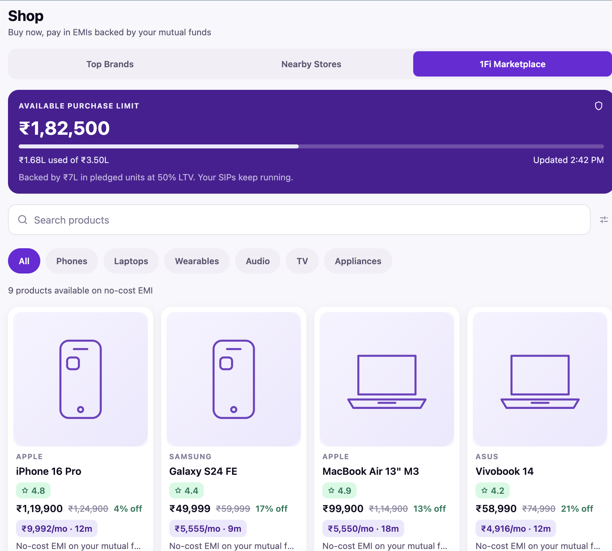
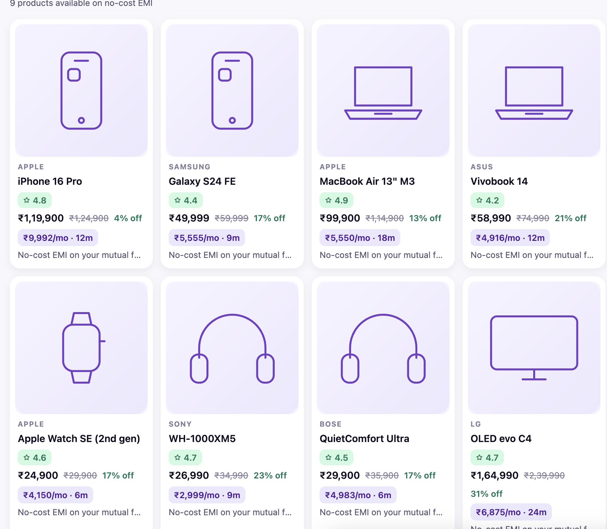
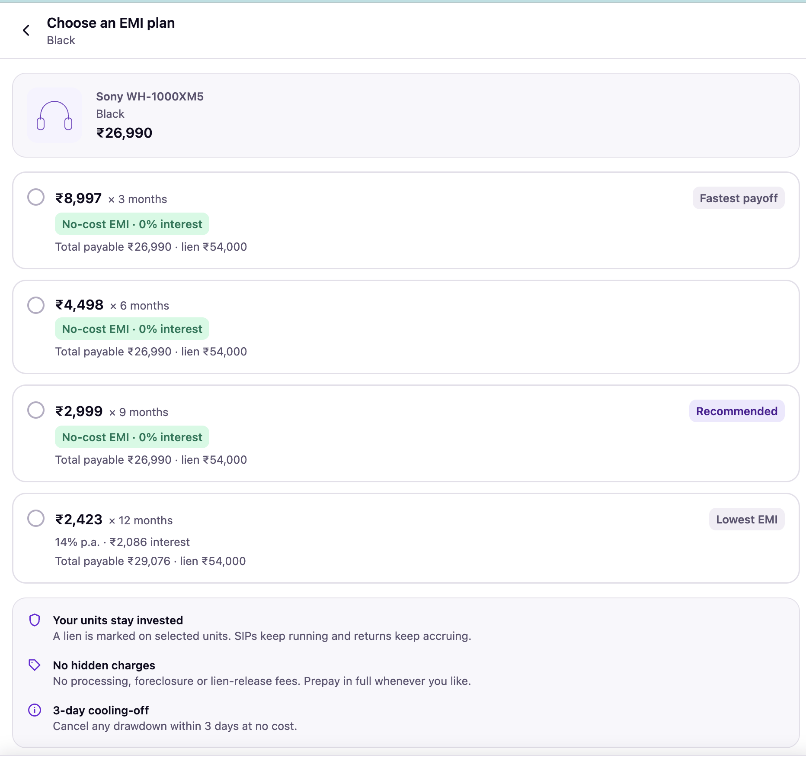
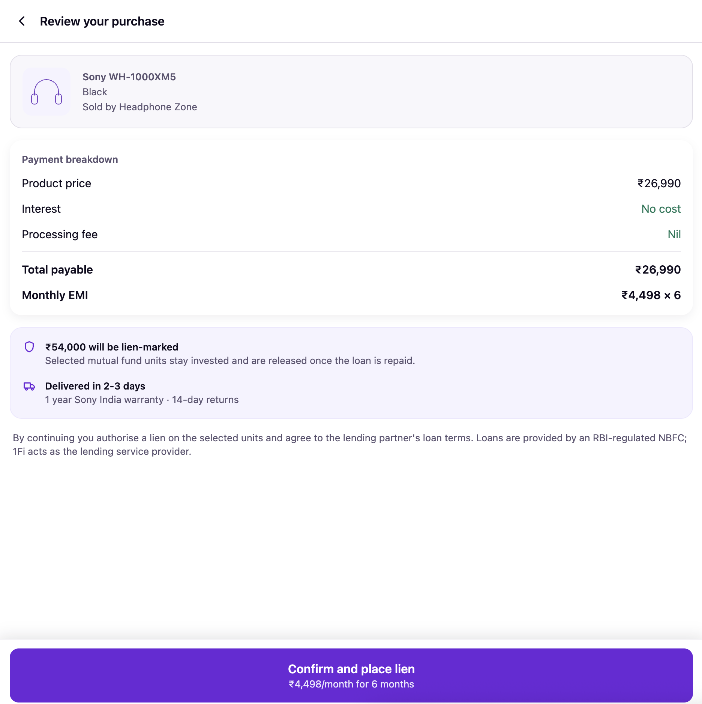

# 1Fi Marketplace — SDE Intern Assignment

A new **1Fi Marketplace** section inside the existing **Shop** page, built in React Native (Expo + TypeScript).

The Shop page carries the three required options — **Top Brands**, **Nearby Stores**, and **1Fi Marketplace**. The first two are intentional placeholders per the brief. The Marketplace is fully implemented end to end: browse → product detail → variant selection → EMI plan selection → review → confirmation.

**Live demo:** http://localhost:8081/
*(web build — safe-area padding and native gestures are accurate only on a device)*

| Shop | Product detail | EMI plans | Confirmation |
|---|---|---|---|
|  |  |  |  |

---

## Running it

```bash
npm install
npm start
```

Press `w` for the browser, `a` for an Android emulator, or scan the QR with Expo Go. `npm start` serves on `http://localhost:8081` on your own machine.

```bash
npm run typecheck   # tsc --noEmit
npm test            # unit tests for the EMI and currency logic
```

Requires Node 18+. No backend or API keys — the data layer is self-contained.

---

## What's in the flow

| Screen | What it does |
|---|---|
| **Shop** | Three segmented options. Marketplace opens by default. |
| **Marketplace** | Purchase-limit card, search, category filter, responsive product grid, pull-to-refresh. |
| **Product detail** | Gallery, price with discount, variant matrix, no-cost EMI preview, highlights, merchant info, specs. |
| **EMI plans** | Full tenure ladder with per-plan pricing, eligibility against the live limit, and merchandising tags. |
| **Review** | Payment breakdown, lien amount, lending disclosure, submit with loading and error handling. |
| **Confirmation** | Order ID, EMI schedule summary, first EMI date, cooling-off note. |

The domain is 1Fi's actual one: purchases are **no-cost EMI drawdowns against pledged mutual fund units**, so every screen is priced against the user's available purchase limit and shows the lien amount rather than treating this like a generic BNPL cart.

---

## Architecture

```
src/
├── api/              # data layer — the only thing that knows where data comes from
│   ├── client.ts     # mock transport: latency, cancellation, typed errors, TTL cache
│   ├── marketplace.api.ts
│   └── mock/         # JSON payloads, shaped like real API responses
├── types/            # domain models — the contract between api/ and the UI
├── hooks/            # useAsyncResource + one hook per resource
├── store/            # CheckoutContext — the product→variant→plan→order selection
├── theme/            # colour, spacing, radius, shadow and type tokens
├── components/
│   ├── common/       # AppText, Button, Card, Badge, Skeleton, StateView, Icon…
│   └── marketplace/  # ProductCard, VariantSelector, EmiPlanCard, PurchaseLimitCard…
├── screens/
├── navigation/
└── utils/            # currency (Indian grouping), EMI maths, dates
```

**Data flows one way:** `mock JSON → api/ → hooks/ → screens → components`. No component imports a fixture, and no component computes a price. Swapping the mock transport for `fetch` against a real service is a change to `src/api/client.ts` and nothing else.

### Notable decisions

**No hardcoded data in components.** Products, EMI ladders and the purchase limit all arrive through `src/api`, which returns typed promises with simulated latency and failure. Screens can't tell the difference between the fixture and a live endpoint.

**One async primitive.** `useAsyncResource` handles the four things every screen otherwise re-implements: first-load vs. refresh, cancellation on unmount or param change, typed errors, and retry. Screens render state; they never manage it.

**EMI pricing lives in the data layer.** `utils/emi.ts` holds pure, tested functions — reducing-balance amortisation, LTV-based lien sizing, eligibility, merchandising tags — and `marketplace.api.ts` calls them. The UI receives plans already annotated with `eligible` and `ineligibleReason`. A plan the user can't take is never tagged "Recommended"; recommending something unavailable is a trust problem, not a nudge.

**The variant matrix is derived, not declared.** `useVariantSelection` reads the attribute groups off the product payload, so a phone gets Storage × Colour, a laptop gets Memory × Storage and a TV gets Screen size — with no per-product UI code. Picking an option that would produce a combination the catalogue doesn't carry snaps the other attributes to the nearest real variant, so it's impossible to land on a dead end.

**Route params carry ids only.** Objects live in `CheckoutContext`. Deep links and state restoration keep working, and navigation state stays small.

**State management is sized to the problem.** Server data lives in hooks with a cache; cross-screen selection lives in one Context; everything else is local `useState`. A global store would be machinery this feature doesn't need.

### Loading, error and empty states

Every async surface has all three, and they're specific rather than generic:

- Skeletons mirror the real geometry, so the grid doesn't reflow when data lands — `ProductCardSkeleton` matches `ProductCard` exactly.
- The purchase limit and the catalogue load **independently**, so a limit failure degrades to a neutral message instead of blanking the products.
- Retry is only offered when the error is actually retryable (`ApiError.retryable`).
- `ProductImage` has its own loading and failure handling and falls back to a vector glyph, so a bad CDN entry degrades quietly instead of showing a grey box.
- An `ErrorBoundary` wraps the tree so a render crash doesn't white-screen the app.

**To see these states:** in a dev build, tap the slider icon next to the search field. It exposes *Force error* and *Slow network* toggles on the mock client.

### Responsiveness

Column count is derived from the live viewport via `useWindowDimensions`, not a device check — 2 columns on phones, 3 on large phones and small tablets, 4 above that. It follows rotation, split-screen and foldables. Sticky footers read the bottom safe-area inset directly so CTAs clear the gesture bar on tall Android devices and notched iPhones alike.

### Accessibility

Roles and states on every interactive element (`radio`, `radiogroup`, `tab`, `switch`), labels on icon-only controls, skeletons hidden from screen readers, and a 13pt floor on body copy so the financial detail on the EMI screens stays legible.

---

## Consistency with the existing app

The Marketplace is built on tokens, not one-off styles. `src/theme` is the single source for colour, spacing, radius, elevation and the type scale, and **no component contains a hex value or a raw font size**. The palette is anchored on 1Fi's brand purple `#6C28D9`.

That's deliberate: aligning this section pixel-for-pixel with production is a change to three files in `src/theme`, not a sweep through every component.

---

## Mock data

`src/api/mock/products.json` holds nine products across six categories, each with real variant matrices, specifications, merchant details and per-product no-cost tenure windows. `limit.json` sets an available limit of ₹1,82,500 against a ₹7,00,000 pledged portfolio at 50% LTV.

Those numbers are chosen so the flow exercises its own edges: the 65-inch OLED sits **above** the available limit, which surfaces the ineligible-plan state and the "pledge more units" path rather than leaving it as dead code.

Product imagery renders as vector category glyphs so the demo has no network dependency and never shows a broken image. `ProductVariant.imageUrl` is already in the schema and wired through `ProductImage` — dropping in real CDN URLs needs no code change.

---

## Trade-offs and what I'd do next

- The three Shop options are **segments of one page**, not separate routes. Switching between them is a filter on the same page, so the back button still means "leave Shop". If the production app pushes routes instead, `navigation/types.ts` is the only file that changes.
- The `useAsyncResource` cache is a simple TTL map. At production scale I'd move to React Query for request deduplication, background revalidation and proper invalidation — the hook signatures were kept close to it deliberately, so the migration is mechanical.
- Tests cover the pure financial logic, which is where a bug costs real money. Component tests with React Native Testing Library would be the next layer.
- Search and filtering run client-side against the fixture. Against a real catalogue these become query params — `fetchProducts` already takes a `ProductListQuery`, so the call site doesn't move.
